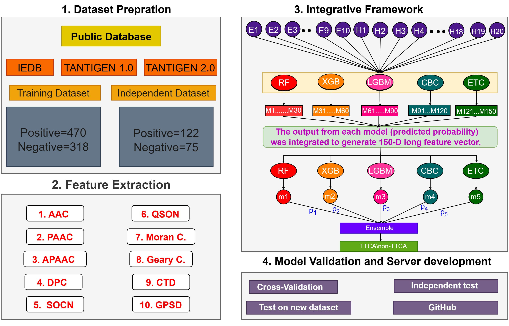

# TTCA-IF
### An ensemble model for the identification of tumor T-cell antigens

# Requirments
### 1. scikit-learn:   0.23.1
### 2. xgboost:   1.3.3
### 3. catboost:   1.0.5
### 4. lightgbm:   2.3.1
### 5. optuna:   2.10.1
### 6. mlxtend:   0.19.0

##
 
 
 

